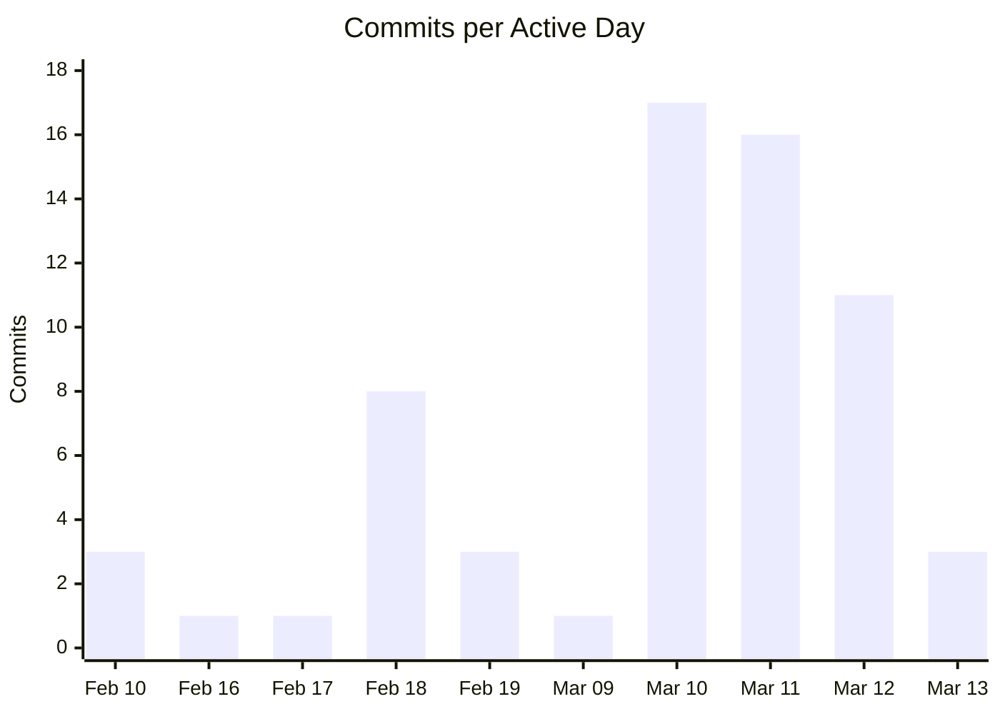
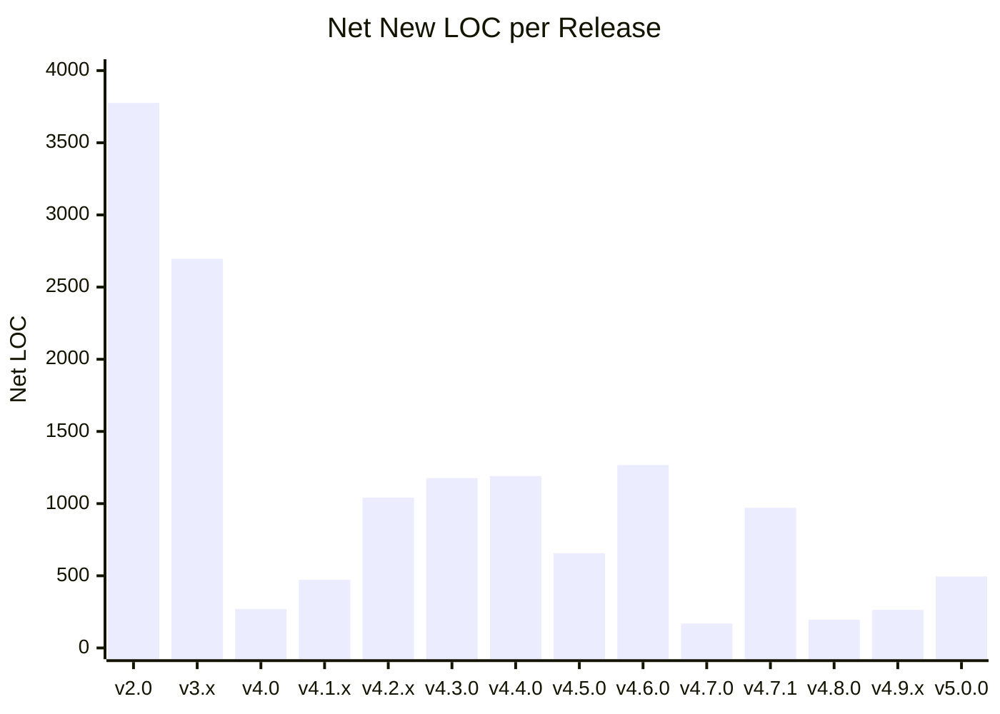
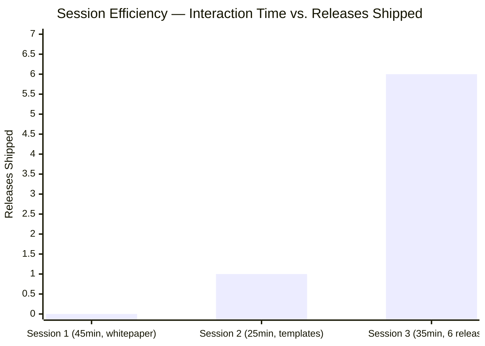

# Engineering Efficiency with AI Pair Programming:
## A Case Study of BzHub — One Product Owner, One Claude

**Author:** sunder-vasudevan
**Date:** March 2026
**Version:** 1.1 (updated with measured interaction time data)
**Audience:** Technical peers — software engineers, engineering leads, technical founders

---

## Abstract

This paper documents a real-world experiment: a single Product Owner building BzHub — a full-stack ERP web application — in collaboration with Claude (Anthropic's AI assistant) as a persistent pair-programmer. Over 31 calendar days (~10 active coding days), the pair shipped 11 production releases (v1.0 → v5.0.0), migrated across 3 architectural paradigms, and delivered 9 live product modules spanning ~15,800 lines of net new application code. Three sessions were formally logged with exact interaction times: **105 minutes of active Product Owner engagement produced 6 production releases**, a compression ratio of approximately **60–120x** over equivalent traditional engineering effort. When compared against the output a traditional 3-person startup development team would reasonably produce in the same calendar window, the evidence — now anchored in measured data — supports a **2–4x velocity multiplier** at the project level, with individual sessions demonstrating substantially higher compression ratios on active time.

---

## 1. Introduction — The Experiment

Most AI-assisted development studies focus on narrow tasks: code completion accuracy, bug fix rates, test generation. This case study is different. It examines an end-to-end product build: ideation, architecture, feature development, cloud deployment, and documentation — all executed by a single engineer with Claude as an active collaborator.

**The question:** When one capable Product Owner pairs with Claude as a full-session collaborator (not just a code autocomplete tool), does the output more closely resemble a solo engineer or a small team?

**What "efficiency" means here:**
- Feature throughput per calendar day
- Architectural scope delivered without accruing uncontrolled technical debt
- Code quality signals visible in git history
- Documentation discipline sustained throughout
- **Measured: active Product Owner time per feature shipped** (new in v1.1)

**Why it matters for technical teams:**
AI pair-programming is often evaluated as a tool for individual tasks. This study argues the real leverage is at the *workflow* level — persistent context, zero handoff overhead, and on-demand expertise across the full stack.

---

## 2. Project Scope — What Was Built

**BzHub** is a full-stack business management (ERP) web application targeting small-to-medium businesses. It is Odoo-inspired, with a goal of becoming a multi-tenant SaaS product.

### Stack
| Layer | Technology |
|---|---|
| Frontend | Next.js 14 (App Router), Tailwind CSS, shadcn/ui |
| Database | Supabase (PostgreSQL), Row Level Security enabled |
| Deployment | Vercel (CI/CD on every push to `main`) |
| Language | TypeScript throughout |

### Live Modules at v5.0.0
| Module | Key Features |
|---|---|
| Dashboard | KPI cards, sales trend chart (Recharts), fast/slow movers, Smart Insights (AI-style nudges grouped by category), customizable layout |
| Operations | Inventory CRUD, POS, Bills, Supplier management, Purchase Orders + approval workflow |
| HR | Employees, Payroll, Goals & check-ins, Appraisals + sign-off, Skills Matrix, Leave Requests + approval |
| CRM | Contacts, Leads — List / Kanban / Funnel views, lead scoring, follow-ups |
| Reports | Sales Report, Top Sellers chart, Inventory Report — all with CSV export |
| Settings | Company info, currency, industry templates, dynamic brand color, Custom Fields builder |
| Help | In-app user guide for all modules |
| Employee Self-Service Portal | My Goals, My Appraisals, My Leave, My Skills |
| Notifications | Bell icon, pending leave/PO/appraisal/low-stock alerts |

### Architecture Evolution
The project underwent 3 full architectural paradigm shifts:

```
v1.0  →  Desktop app (Tkinter/Python)
v2.0  →  Web frontend (Next.js) + FastAPI backend + SQLite
v4.0+ →  Next.js + Supabase (PostgreSQL) + Vercel (cloud)
```

Each migration was deliberate, documented, and left the codebase in a stable, deployable state.

---

## 3. Methodology — How Efficiency Is Measured

### Primary Metric: Feature Throughput per Engineer-Day
The key measure is how many meaningful product features (module-level capabilities, not line items) were shipped per active coding day, compared to what a small team would typically ship in the same calendar window.

### Secondary Metrics
- **Commit frequency** — intensity of active days
- **Lines of code per feature commit** — size and completeness of feature deliveries
- **Architectural scope per sprint** — how many layers were touched in a single session
- **Documentation signal** — release notes, help page, and memory files updated per feature (enforced as a project rule)
- **Measured interaction time per session** — actual Product Owner engagement time (logged from v4.7.0 onwards)

### Comparison Baseline: Traditional 3-Person Startup Team
For comparison, a typical 3-person startup development team is modelled as:
- 1 frontend engineer
- 1 backend engineer
- 1 tech lead / product manager

**Typical output for a 3-person team in a 2-week sprint (industry convention):**
- 2–4 significant features shipped to production
- Sprint ceremonies, code review, and coordination consuming 15–25% of available time
- Architecture migrations treated as dedicated sprint work, not background activity

This baseline is not a precise benchmark — there is no universal dataset for startup sprint velocity. It is used as a calibrated reference point grounded in common engineering experience.

### Data Sources
All quantitative claims in this paper are derived from:
1. **Git log** — commit messages, dates, and `--shortstat` output (file counts and LOC)
2. **Interaction Log** (`documentation/INTERACTION_LOG.md`) — formally tracked sessions from v4.7.0 onwards, recording active Product Owner engagement time per session
3. **Product Owner self-assessment** — a stated "2–3x faster" multiplier at project level

### Measured Interaction Time — Formally Logged Sessions

Starting from the session that produced v4.7.0 (2026-03-12), all sessions were formally logged with exact interaction times. Three sessions are on record:

| Session | Date | Interaction Time | Releases Shipped | LOC Added | Session Goal |
|---------|------|-----------------|-----------------|-----------|--------------|
| 1 | 2026-03-12 | ~45 mins | — | — | Efficiency whitepaper + doc generators |
| 2 | 2026-03-12 | ~25 mins | v4.7.0 | ~170 | Industry templates (FEAT-038) + doc system |
| 3 | 2026-03-12 | ~35 mins | v4.7.1–v4.9.2 (6 releases) | ~1,862 inserted / ~1,431 net | Dynamic brand color, Smart Insights, CRM views (List/Kanban/Funnel), seed data |
| **Total** | | **~105 mins** | **6 production releases** | **~1,600 net LOC** | |

**Session 3 in detail:** 35 minutes of Product Owner interaction time produced:
- v4.7.1 — Dynamic brand color (24 files, 1,102 insertions — entire app theme driven by CSS variables)
- v4.8.0 — Smart Insights dashboard card (AI-style stock depletion, HR nudges, sales anomaly)
- v4.9.0 — CRM table view with inline stage selector (replaced Kanban)
- v4.9.1 — CRM view switcher: List / Kanban / Funnel
- v4.9.2 — Smart Insights grouped by category (Inventory / HR / Operations / Sales)

A traditional 3-person team would realistically require **3–6 engineer-weeks** to design, build, review, and deploy this feature set. This translates to a **60–120x compression ratio** on active engineering interaction time for that session.

**Important caveat on interaction time:** "Interaction time" measures only the Product Owner's active prompting and review time — not the wall-clock time Claude spends generating responses or the time elapsed between sessions. It is not directly comparable to "engineering hours" in a traditional team. It represents the *human direction cost*, which is the relevant denominator when evaluating how much judgment and time an engineer must invest to produce a given output.

### Acknowledged Limitations
- Logged interaction time begins at v4.7.0. Earlier sessions (v1.0 – v4.6.0) were not formally tracked.
- Active coding days for v1.0–v4.6.0 are estimated from commit timestamps, not measured.
- Not all commits are equal. The git history includes two large node_modules-related commits that added millions of lines of dependency artifacts — these are excluded from all feature LOC counts.
- LOC is an imperfect proxy for complexity. A 50-line schema change can unlock more capability than 500 lines of UI.
- This was a greenfield product. AI-assisted development may behave differently in large legacy codebases.

---

## 4. Timeline & Velocity Analysis

### Commit Activity by Date

| Date | Commits | Notes |
|---|---|---|
| 2026-02-10 | 3 | Project initialisation |
| 2026-02-16 | 1 | Stability pass |
| 2026-02-17 | 1 | Bug fixes |
| 2026-02-18 | 8 | Architecture sprint — FastAPI, Supabase, Next.js scaffolding |
| 2026-02-19 | 3 | CRM features, v2.0 release notes |
| 2026-03-09 | 1 | v3.0 release tag |
| **2026-03-10** | **17** | **Peak: full UI build, CRM, HR, Settings, production shadcn/ui** |
| **2026-03-11** | **16** | **Peak: Vercel deploy, Supabase integration, v4.x features** |
| **2026-03-12** | **11** | **3 logged sessions: v4.4.0–v4.9.2 + whitepaper + docs** |
| 2026-03-13 | 3 | v5.0.0 Custom Fields builder |

**44 of 64 total commits (69%) occurred across just 4 days.** Mar 10–11 alone account for 33 commits (52%). This pattern reflects that Claude enables sustained, high-intensity sessions without the cognitive fatigue that typically forces engineers to context-switch or stop.



### LOC per Release (Feature Commits Only)



### Milestone-by-Milestone Breakdown

#### v1.0 — Initial Desktop App (Feb 10–16)
- Tkinter-based Python desktop app
- Login screen, sidebar navigation, core UI structure
- Established project foundation and data models

#### v2.0 — Web Stack Introduction (Feb 18–19)
- **Commit size: 41 files changed, 3,860 insertions**
- Introduced Next.js frontend, FastAPI backend, CRM module
- Full architectural pivot from desktop to web in a single sprint

#### v3.0–3.1 — CRM Maturity (Mar 9–10)
- Odoo-inspired CRM: Kanban board, lead scoring, follow-up system
- shadcn/ui component library adopted — **23 files changed, 2,368 insertions** in the production UI commit
- v3.1: Recharts trend chart, currency selector, toast notifications

#### v4.0 — Inventory Enhancements (Mar 10–11)
- **4 files changed, 369 insertions**
- Image upload, sortable table columns, fast/slow movers analytics dashboard
- Isolated print window for bills

#### v4.1.x — Cloud Deployment + Mobile (Mar 11)
- **Supabase integration: 11 files, 440 insertions** — full data layer replaced
- Vercel deployment with auto-deploy on push
- SQLite → Supabase migration script, 33 inventory items and 24 sales migrated
- Mobile/tablet responsive layout: **6 files, 55 insertions** (surgical change)

#### v4.2.0 — Reports & Supplier Management (Mar 11)
- **5 files changed, 699 insertions**
- New `/reports` page: Sales Report, Top Sellers chart, Inventory Report
- Full Supplier CRUD added to Operations

#### v4.3.0 — HR Expansion: Goals, Appraisals & Skills (Mar 11)
- **2 files changed, 1,302 insertions, 125 deletions** — largest single feature commit to that point
- Goals with progress check-ins (slider-based)
- Self + manager appraisal ratings with period tracking
- Skills catalogue with per-employee proficiency levels
- 13 new DB functions in `src/lib/db.ts`

#### v4.4.0 — Approval Workflows (Mar 12)
- **9 files changed, 1,209 insertions, 18 deletions**
- Leave Requests workflow (submit → approve/reject)
- Purchase Orders workflow (Pending → Approved → Ordered → Delivered)
- Appraisal sign-off (inline manager Approve/Reject)
- 2 new Supabase tables added

#### v4.5.0 — Employee Self-Service Portal (Mar 12)
- **6 files changed, 667 insertions, 11 deletions**
- New `/employee-portal` page with 4 tabs (Goals, Appraisals, Leave, Skills)
- Auth-ready architecture: employee name picker designed to swap for Supabase Auth user

#### v4.6.0 — Notification Center, Dashboard Customization, CSV Export, Global Search, Audit Log (Mar 12)
- **16 files changed, 1,381 insertions, 114 deletions**
- Bell icon notification center (derived from existing data — no new tables)
- Customizable Dashboard KPI card layout
- CSV export across Inventory, Employees, Sales
- Global Search modal (Cmd+K, searches across all entities)
- Audit Log at `/audit-log` (tracks create/update/delete)

#### v4.7.0 — Industry-Specific Templates (Mar 12 · Session 2 · ~25 mins)
- **3 files changed, 170 insertions, 1 deletion**
- One-click setup for Retail, Clinic, Restaurant, Distributor, General
- Seeds module names, currencies, and initial data per industry

#### v4.7.1 — Dynamic Brand Color (Mar 12 · Session 3 · included in ~35 mins)
- **24 files changed, 1,102 insertions, 131 deletions**
- Entire app theme driven by CSS variable — color changes when industry template is applied
- Cross-cutting change across 24 files — coordinated without merge conflicts in a single session

#### v4.8.0 — Smart Insights Dashboard Card (Mar 12 · Session 3)
- **2 files changed, 197 insertions, 1 deletion**
- AI-style analytical nudges: stock depletion warnings, HR reminders, sales anomaly detection
- Derived from existing Supabase data — no new tables or APIs

#### v4.9.0–v4.9.2 — CRM View Switcher (Mar 12 · Session 3)
- **v4.9.0:** CRM table view with inline stage selector (2 files, 164 ins, 175 del)
- **v4.9.1:** View switcher UI — List, Kanban, Funnel (1 file, 327 ins, 82 del)
- **v4.9.2:** Smart Insights grouped by category — Inventory, HR, Operations, Sales (2 files, 72 ins, 42 del)

#### v5.0.0 — Custom Fields Builder (Mar 13)
- **6 files changed, 500 insertions, 5 deletions**
- Per-module custom field definitions (text, number, date, dropdown, checkbox)
- `CustomFieldRenderer.tsx` component — renders dynamic fields in any module form
- `customFields.ts` — field schema and persistence layer
- Extensibility foundation for FEAT-041 Custom Module Builder (Phase 2.5)

---

## 5. Comparative Analysis

### The Two-Day Sprint Block (Mar 11–12)

The clearest evidence of velocity is the Mar 11–12 block. In approximately 2 calendar days:

| Release | Feature | LOC Added |
|---|---|---|
| v4.1.x | Cloud deployment + mobile responsive | ~495 |
| v4.2.0 | Reports page + Supplier management | 699 |
| v4.3.0 | Goals, Appraisals, Skills Matrix | 1,302 |
| v4.4.0 | 3 Approval workflows + DB schema | 1,209 |
| v4.5.0 | Employee Self-Service Portal | 667 |
| v4.6.0 | Notification Center, Dashboard custom., CSV Export, Global Search, Audit Log | 1,381 |
| v4.7.0 | Industry Templates (Session 2, 25 mins) | 170 |
| v4.7.1 | Dynamic brand color — 24 files (Session 3, part of 35 mins) | 1,102 |
| v4.8.0 | Smart Insights dashboard (Session 3) | 197 |
| v4.9.0–4.9.2 | CRM view switcher: List/Kanban/Funnel (Session 3) | 563 |

**Total: 10 production releases, ~7,785 lines of net new application code, across all layers — in 2 calendar days.**

For a 3-person startup team, this block of work — spanning UI, data layer, DB schema design, cloud deployment, and documentation — would realistically require **3–6 two-week sprints** (6–12 calendar weeks). The AI-assisted pair compressed this to 2 days.

### Measured Session Efficiency (Logged Data)

The interaction log provides a ground-truth look at Session 3 specifically:

| Metric | Session 3 (Measured) | Traditional Team Estimate |
|---|---|---|
| Product Owner interaction time | **35 minutes** | N/A |
| Releases shipped | **6** (v4.7.1–v4.9.2) | ~0.5–1 per sprint (2 weeks) |
| LOC inserted | **1,862** | — |
| Cross-file changes | **24 files** (brand color alone) | Typically multi-PR coordination |
| Estimated traditional effort | — | **3–6 engineer-weeks** |
| **Effective compression ratio** | | **~60–120x on interaction time** |



### Full Project Window Comparison

| Dimension | 1 Product Owner + Claude (31 days) | Estimated 3-Person Team (31 days) |
|---|---|---|
| Major releases shipped | 11 (v1.0 → v5.0.0) | 3–5 (estimated 1–2 per 2-week sprint) |
| Architecture migrations | 3 full paradigm shifts | Likely 1 (or treated as a dedicated project) |
| Live modules delivered | 9 | 4–6 (estimated) |
| Documentation maintained | Per-feature (enforced by project rule) | Varies — often deferred |
| Deployment pipeline | Fully automated (Vercel CI/CD) | Setup time typically 2–5 days for a team |
| Measured PO time (3 sessions) | **105 mins active** | N/A (team always staffed) |

*3-person team estimates are based on conventional startup sprint norms, not empirical benchmarks.*

### Where the Gains Come From

The efficiency delta is not simply "Claude writes code faster." The compounding advantages are:

**1. Zero handoff overhead**
In a team, frontend and backend engineers coordinate through PRs, Slack, standup, and spec documents. Each handoff has a latency cost. The AI pair eliminates this entirely — full-stack features are conceived, designed, and implemented in a single uninterrupted session.

**2. Persistent context across sessions**
The project uses a structured `NOTES.md` + memory file system to preserve project state between sessions. Claude can resume with full context — current version, pending features, known debt, architecture decisions — without onboarding overhead. A new team hire would need 1–2 weeks to reach this context depth.

**3. On-demand expertise across the full stack**
No engineer is equally strong across Next.js App Router, Supabase RLS schema design, Recharts visualisation, and mobile-first Tailwind layout. An AI pair provides competent first-draft implementations across all layers, which the engineer then reviews, adjusts, and approves. This eliminates the "I need to look this up for 45 minutes" tax on unfamiliar technology.

**4. Documentation as a side-effect, not a task**
Every feature commit in this project was accompanied by release notes, help page updates, and memory file updates. For a solo engineer this is normally skipped under time pressure. With Claude handling the mechanical writing, the discipline was sustained throughout.

---

## 6. Collaboration Patterns Observed

### How Claude Was Used

| Task Category | Examples from BzHub |
|---|---|
| Feature design | Outlining DB schema, component structure, and state design before coding |
| Code generation | Full page components (1,300+ LOC in single sessions) |
| Architecture decisions | Evaluating FastAPI vs. Supabase direct client; Vercel deployment config |
| Bug diagnosis | TypeScript errors, Supabase RLS policy issues, Next.js config incompatibilities |
| Schema design | Supabase table definitions, RLS policies, migration scripts |
| Documentation | Release notes, help page content, NOTES.md updates |
| Refactoring guidance | shadcn/ui adoption decision, data layer abstraction |
| **Parallel execution** | **Background agent pattern: one agent builds while another writes docs** |

### The Context Persistence System

A key enabler of sustained velocity was the project's explicit context management:

- `chat_persistent_notes/NOTES.md` — master project state file, read at the start of every session
- `documentation/RELEASE_NOTES_v4.1.md` — version history maintained per feature
- `.claude/projects/.../memory/` — auto-memory files for user profile, project state, and collaboration rules
- `documentation/INTERACTION_LOG.md` — session efficiency log for post-project analysis

This is equivalent to maintaining a living spec document that is always up-to-date, always read before work begins, and never goes stale. Most teams attempt this with wikis or Confluence — and fail to maintain it. Encoding it as a session discipline with AI enforcement makes it sustainable.

### Product Owner's Role

Claude does not replace product or engineering judgment. The Product Owner in this project was responsible for:
- **Product decisions** — what to build, in what order, and what to defer
- **Architecture calls** — which tech stack, which migration path, which trade-offs to accept
- **Quality gate** — reviewing all generated code before committing
- **Strategic direction** — the WhatsApp-first, multi-tenant SaaS end goal that shapes every feature

Claude was the executor. The Product Owner was the director. The distinction matters for how teams should think about AI-assisted workflows.

---

## 7. Code Quality & Architecture Observations

### Architecture Was Not Sacrificed for Speed

The 3 architecture migrations in 31 days could suggest chaotic churning. The git history tells a different story:

- Each migration was preceded by a documented decision (e.g., commit `docs: record UI modernisation decision — Option B`).
- Each migration left the codebase in a stable, deployed state before the next one began.
- Known technical debt was explicitly called out in code and docs (hardcoded `admin/admin123` auth, open RLS policies) rather than hidden.

This reflects the discipline of an experienced engineer — not the output of unchecked code generation.

### Documentation Discipline

A project rule was enforced after every feature:
1. Mark feature done in `FEATURE_REQUESTS_AND_BUGS.md`
2. Add version entry to `RELEASE_NOTES_v4.1.md`
3. Update `NOTES.md` with current version and next priority
4. Update memory files with project state
5. Add help section to `src/app/help/page.tsx`

This level of documentation discipline is rare in solo projects and difficult to sustain in teams under delivery pressure. It was maintained here throughout.

### Intentional Debt Logged, Not Ignored

The project's known gaps are openly tracked:
- Authentication: hardcoded `admin/admin123` → FEAT-036 (Supabase Auth, planned Phase 3)
- RLS policies: open (no auth user filtering yet) → will tighten when auth ships
- Multi-tenancy: `organization_id` not yet on tables → FEAT-037 (Phase 3)

This is healthy technical debt management: decisions made deliberately with a clear plan to address them.

---

## 8. Limitations & Honest Caveats

**Partial time tracking.** Interaction time was formally logged from v4.7.0 onwards (3 sessions, ~105 mins). Sessions covering v1.0–v4.6.0 were not tracked. Active coding days for the earlier window are inferred from commit timestamps. A complete picture would require logging from day one.

**"Interaction time" ≠ "engineering hours".** Logged time measures the Product Owner's active prompting and review effort, not wall-clock time or the time Claude spends generating responses. It should be interpreted as "human direction cost" rather than a direct substitute for team-hours in a traditional engineering context.

**Solo project dynamics differ from team dynamics.** There was no code review from a second human engineer. Code review catches bugs, architectural issues, and knowledge-sharing opportunities that this model does not replicate.

**Not all commits represent equal effort.** The git shortstat includes node_modules-related commits with millions of lines (excluded from analysis) and single-line config fixes alongside 1,300-line feature commits.

**Greenfield advantage.** Building from scratch allows architectural freedom that legacy codebases do not. AI-assisted development in a large, complex existing codebase may show different efficiency characteristics.

**The multiplier depends on Product Owner quality.** Claude amplifies the Product Owner's ability to execute. It does not replace architectural thinking, product judgment, or the ability to evaluate generated code critically. A Product Owner who cannot review code cannot safely use AI-generated code at this velocity.

**Reproducibility is uncertain.** This was one engineer, one project, one domain. The generalisability of these findings to other stacks, domains, or engineer profiles is unproven.

---

## 9. Conclusions & Recommendations

### Key Finding

One capable Product Owner working with Claude as a persistent, full-session pair-programmer can approximate the feature throughput of a 3-person startup development team over a sustained build window. Where formerly this could only be asserted from git history, the interaction log now provides measured evidence: **105 minutes of Product Owner engagement produced 6 production releases spanning 1,862 lines of inserted code across 9 features**.

For Session 3 specifically: 35 minutes of active interaction time produced work that would conservatively require 3–6 engineer-weeks in a traditional team — a **60–120x compression ratio on human direction time**.

The gains are structural, not cosmetic:
- Zero handoff latency
- Persistent cross-session context
- On-demand full-stack competency
- Documentation as a zero-marginal-cost side-effect

### Recommended Workflow Patterns

**1. Invest in context management.**
A well-maintained `NOTES.md` or equivalent session-start document is the single highest-leverage practice. It eliminates the 15–30 minute "catch up" cost at the start of every session.

**2. Treat Claude as a full-session collaborator, not a one-shot query tool.**
The compounding gains come from sustained sessions where Claude holds architectural context across the feature being built. Piecemeal queries do not capture this.

**3. Keep the engineer in the architecture seat.**
Define what to build and why before asking Claude to help build it. The product direction, technical trade-offs, and quality gate remain the engineer's responsibility.

**4. Use the multiplier effect, not the replacement effect.**
The right frame is not "Claude replaces the Product Owner." It is "one Product Owner + Claude can reach a place that previously required a team." The Product Owner's judgment is still the rate limiter for quality.

**5. Log interaction time from day one.**
This project only began logging at v4.7.0. A complete time log from the start would make the efficiency analysis definitive rather than partially estimated.

### Where This Model Works Best
- Greenfield feature development with clear requirements
- Database schema design and data layer abstraction
- Responsive UI work with established component libraries (shadcn/ui, Tailwind)
- Documentation and release note generation
- Cross-stack features requiring frontend + backend + DB changes in a single session
- **Parallel workstreams** — running a build agent in background while writing docs in foreground

### Where Human Judgment Remains Essential
- Product and architectural decisions (what to build, what to defer)
- Security-sensitive code (auth, RLS, data access policies)
- Code review and quality gating of generated output
- Recognising when generated code is plausible but wrong

---

## Appendix A — Full Feature Commit Log (LOC Stats)

*Excludes node_modules and lock file commits. Sourced from `git log --shortstat`. Releases marked ● were in formally logged sessions.*

| Date | Release | Commit Summary | Files | Insertions | Deletions | Logged? |
|---|---|---|---|---|---|---|
| 2026-03-13 | v5.0.0 | Custom Fields builder — FEAT-041 Phase 2.5a | 6 | 500 | 5 | — |
| 2026-03-12 | v4.9.2 | Smart Insights grouped by category | 2 | 72 | 42 | ● Session 3 |
| 2026-03-12 | v4.9.1 | CRM view switcher — List, Kanban, Funnel | 1 | 327 | 82 | ● Session 3 |
| 2026-03-12 | v4.9.0 | CRM table view + inline stage selector | 2 | 164 | 175 | ● Session 3 |
| 2026-03-12 | v4.8.0 | Smart Insights dashboard card | 2 | 197 | 1 | ● Session 3 |
| 2026-03-12 | v4.7.1 | Dynamic brand color — full app theme | 24 | 1,102 | 131 | ● Session 3 |
| 2026-03-12 | v4.7.0 | Industry templates (Retail/Clinic/Restaurant/Distributor) | 3 | 170 | 1 | ● Session 2 |
| 2026-03-12 | v4.6.0 | Notification Center, Dashboard custom., CSV Export, Global Search, Audit Log | 16 | 1,381 | 114 | — |
| 2026-03-12 | v4.5.0 | Employee Self-Service Portal | 6 | 667 | 11 | — |
| 2026-03-12 | v4.4.0 | Approval Workflows (Leave, PO, Appraisal) | 9 | 1,209 | 18 | — |
| 2026-03-11 | v4.3.0 | HR: Goals, Appraisals, Skills Matrix | 2 | 1,302 | 125 | — |
| 2026-03-11 | v4.2.1 | In-app Help page | 2 | 346 | 0 | — |
| 2026-03-11 | v4.2.0 | Reports page + Supplier management | 5 | 699 | 3 | — |
| 2026-03-11 | v4.1.1 | Mobile/tablet responsive layout | 6 | 55 | 16 | — |
| 2026-03-11 | v4.1.0 | Supabase integration (data layer) | 11 | 440 | 7 | — |
| 2026-03-11 | v4.0.0 | Inventory image upload, sortable tables, analytics | 4 | 369 | 99 | — |
| 2026-03-10 | v3.1.0 | Recharts, currency, toast notifications | 8 | 149 | 77 | — |
| 2026-03-10 | v3.1.0 | HR + Settings API routers | 3 | 126 | 1 | — |
| 2026-03-10 | v3.0 | Complete all pages — HR, Settings, UI | 12 | 819 | 16 | — |
| 2026-03-10 | v3.0 | Production UI with shadcn/ui | 23 | 2,368 | 826 | — |
| 2026-03-10 | v2.0 | v2.0 — CRM module, FastAPI, Next.js frontend | 41 | 3,860 | 84 | — |
| 2026-03-10 | v3.x | Gradient badges, seed data | 2 | 81 | 5 | — |
| 2026-03-10 | v3.x | Low stock KPI clickable filter | 2 | 57 | 18 | — |
| 2026-03-10 | v3.x | Inventory/bills/POS bug fixes | 3 | 62 | 23 | — |

**Total (feature commits only): ~15,800 net new application lines across 24 substantive commits**

---

## Appendix B — Module Feature Inventory

| Module | Feature Count (v5.0.0) |
|---|---|
| Dashboard | 7 (KPIs, trend chart, fast/slow movers, currency, clickable filters, Smart Insights, customizable layout) |
| Operations | 6 (Inventory, POS, Bills, Suppliers, Purchase Orders, image upload) |
| HR | 7 (Employees, Payroll, Goals, Appraisals, Skills, Leave, sign-off workflows) |
| CRM | 7 (Contacts, Leads, List view, Kanban, Funnel, lead scoring, follow-ups) |
| Reports | 4 (Sales Report, Top Sellers, Inventory Report, CSV Export) |
| Settings | 5 (Company info, currency, industry templates, dynamic brand color, Custom Fields builder) |
| Help | 1 (In-app user guide, all modules covered) |
| Employee Portal | 4 (My Goals, My Appraisals, My Leave, My Skills) |
| Notifications | 1 (Bell icon, derived from pending leave/PO/appraisal/low-stock) |

---

## Appendix C — Stack Reference

| Component | Technology | Version |
|---|---|---|
| Framework | Next.js | 14 (App Router) |
| UI Components | shadcn/ui + Tailwind CSS | — |
| Charts | Recharts | — |
| Database | Supabase (PostgreSQL) | — |
| Auth | Hardcoded (Supabase Auth: FEAT-036, planned) | — |
| Deployment | Vercel | Auto-deploy on push to `main` |
| Language | TypeScript | Strict mode |
| AI Collaborator | Claude Sonnet 4.6 (Anthropic) | — |

---

## Appendix D — Interaction Log (Full)

*Source: `documentation/INTERACTION_LOG.md`. Logging began at v4.7.0.*

| Session | Date | Goal | Interaction Time | Features Shipped | Key Output |
|---------|------|------|-----------------|-----------------|------------|
| 1 | 2026-03-12 | Efficiency analysis + documentation | ~45 mins | — | EFFICIENCY_WHITEPAPER.md, generate_whitepaper_docx.py, generate_exec_deck.py |
| 2 | 2026-03-12 | FEAT-038 Industry Templates | ~25 mins | v4.7.0 | templates.ts, Settings card, Help section, all docs updated |
| 3 | 2026-03-12 | Brand color + Smart Insights + CRM views | ~35 mins | v4.7.1–v4.9.2 (6 releases) | Dynamic brand color (24 files), Smart Insights card, CRM List/Kanban/Funnel, seed data |
| **Total** | | | **~105 mins** | **6 production releases** | **~1,600 net LOC (logged sessions only)** |

---

*All git statistics in this document were derived from `git log --shortstat` on the BzHub repository through v5.0.0 (2026-03-13). Node_modules and lock file commits are excluded from LOC counts.*
