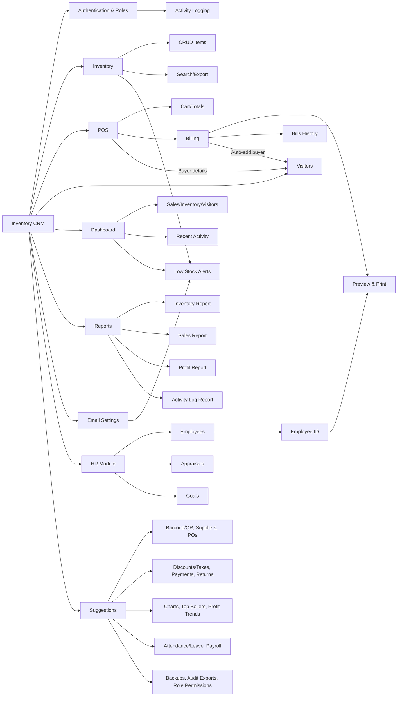

```mermaid
flowchart LR
  A[Inventory CRM]

  A --> AUTH[Authentication & Roles]
  AUTH --> LOG[Activity Logging]

  A --> INV[Inventory]
  INV --> INVCRUD[CRUD Items]
  INV --> INVSEARCH[Search/Export]
  INV --> LOW[Low Stock Alerts]

  A --> POS[POS]
  POS --> CART[Cart/Totals]
  POS --> BILL[Billing]
  BILL --> PREVIEW[Preview & Print]
  BILL --> HISTORY[Bills History]

  A --> VIS[Visitors]
  POS -->|Buyer details| VIS
  BILL -->|Auto-add buyer| VIS

  A --> DASH[Dashboard]
  DASH --> METRICS[Sales/Inventory/Visitors]
  DASH --> RECENT[Recent Activity]
  DASH --> LOW

  A --> REPORTS[Reports]
  REPORTS --> INVREP[Inventory Report]
  REPORTS --> SALESREP[Sales Report]
  REPORTS --> PROFITREP[Profit Report]
  REPORTS --> LOGREP[Activity Log Report]

  A --> EMAIL[Email Settings]
  EMAIL --> LOW

  A --> HR[HR Module]
  HR --> EMP[Employees]
  HR --> APP[Appraisals]
  HR --> GOAL[Goals]
  EMP --> ID[Employee ID]
  ID --> PREVIEW

  A --> SUG[Suggestions]
  SUG --> SUGINV[Barcode/QR, Suppliers, POs]
  SUG --> SUGPOS[Discounts/Taxes, Payments, Returns]
  SUG --> SUGAN[Charts, Top Sellers, Profit Trends]
  SUG --> SUGHR[Attendance/Leave, Payroll]
  SUG --> SUGOPS[Backups, Audit Exports, Role Permissions]
```